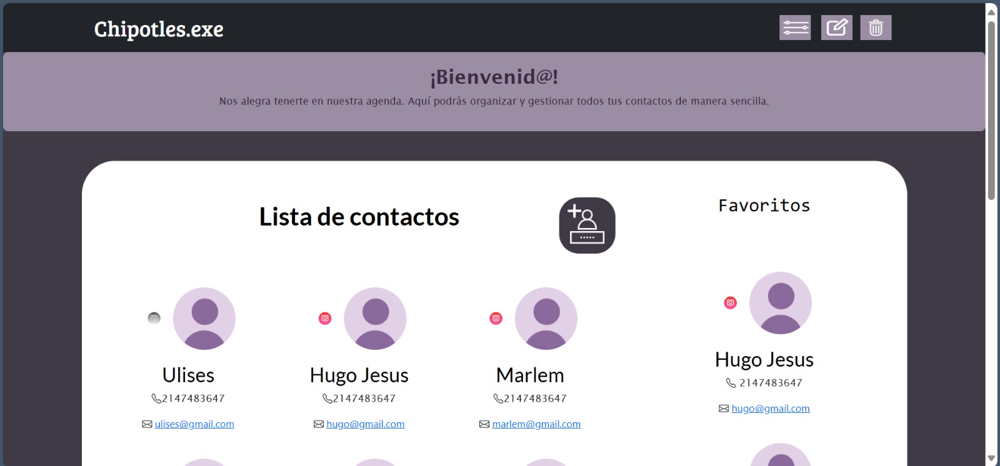
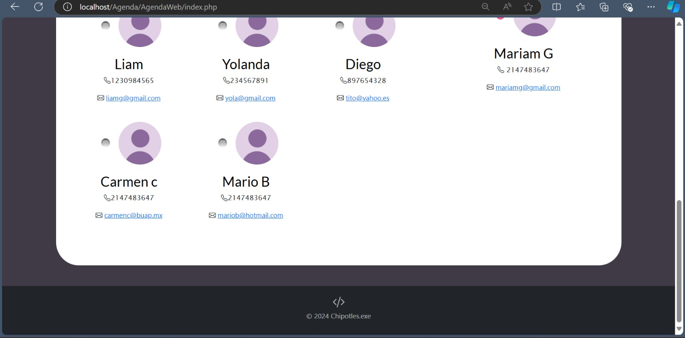
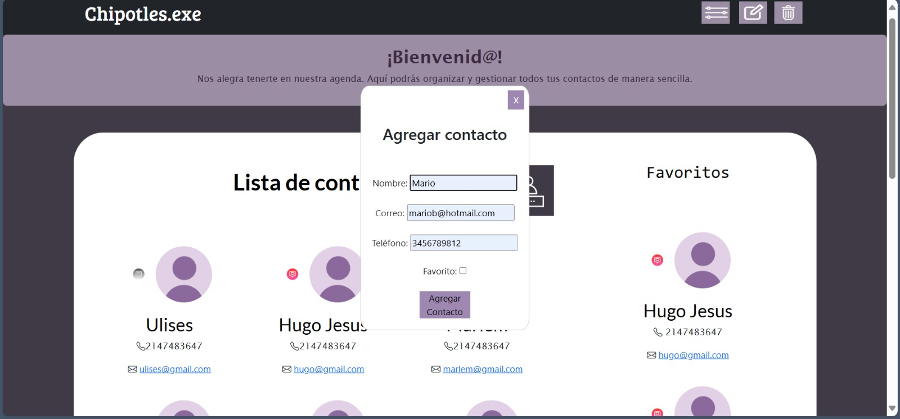
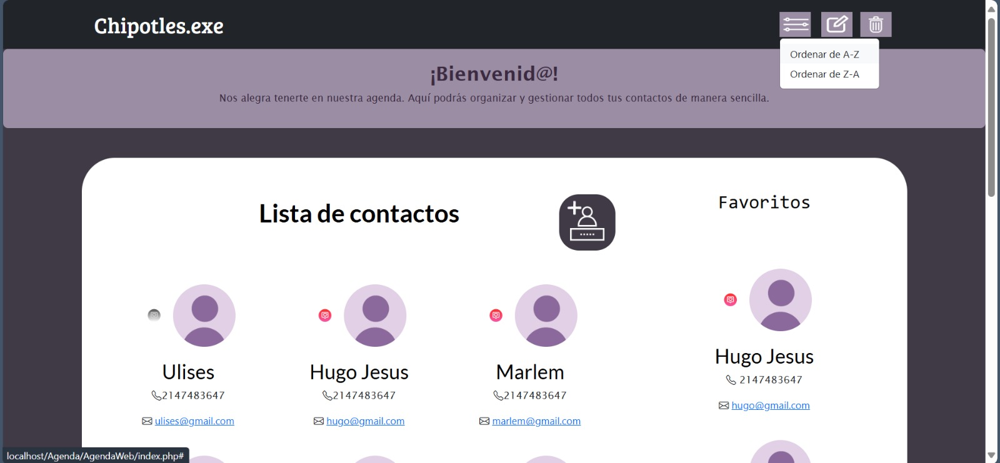
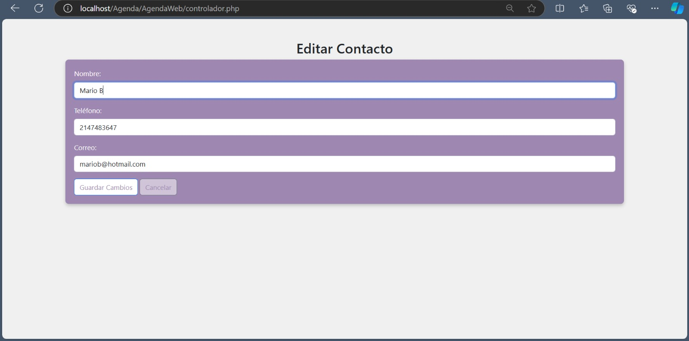
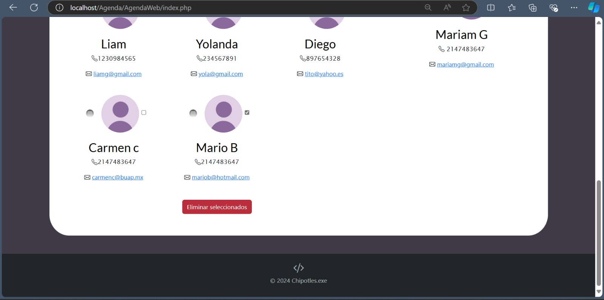

## Agenda web 🖥️📲

Agenda Web de Contactos "Chipotles.exe", desarrollada con HTML, CSS, Bootstrap, PHP y JavaScript. Utilicé HTML para organizar el contenido en secciones claras, CSS para personalizar la apariencia y Bootstrap para un diseño responsivo. Además, implementé PHP para gestionar datos en el servidor y JavaScript para añadir interactividad, creando una experiencia de usuario dinámica y atractiva.

## Vista previa

## Tecnologías
* HTML
* CSS
* Bootstrap
* Php
* JavaScript

---
Desarrollado con 🩷 por [Marlem](https://portafolio-umber-alpha.vercel.app/)
